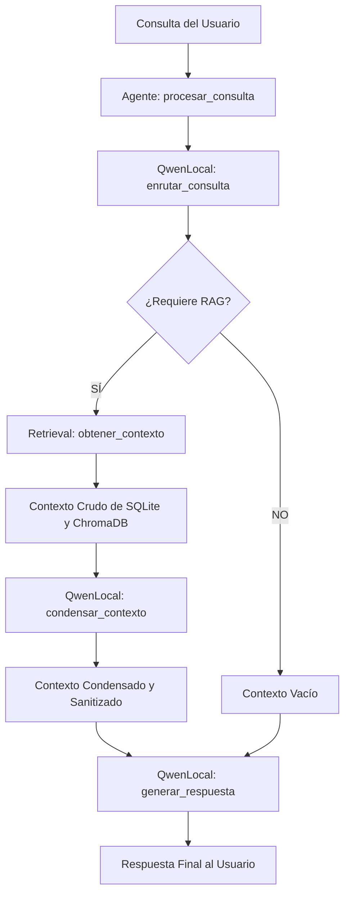

# Sistema de Agente Conversacional RAG Local (Qwen)

Este repositorio contiene la implementación de un sistema de **Generación Aumentada por Recuperación (RAG)** de alta precisión que opera de forma completamente local. Su diseño está orientado a optimizar la eficiencia y reducir las alucinaciones mediante un flujo modular que incluye **enrutamiento inteligente** de consultas y **compresión semántica** de contextos recuperados.

El sistema se compone de tres módulos de código base que orquestan este flujo:
1. `llms/base.py`: Define el contrato operacional e interfaz abstracta de los LLMs en el sistema.
2. `llms/qwen.py`: Implementa el modelo local Qwen, la lógica del enrutador y el motor de compresión semántica.
3. `llms/agente.py`: Orquesta la interacción entre el recuperador RAG y el LLM.

---

## 🏗️ Arquitectura y Flujo de Trabajo

El flujo de procesamiento de una consulta dentro de nuestro Agente sigue una secuencia lógica altamente optimizada:



---

## 🔍 Análisis de Componentes

### 1. Interfaz Abstracta: `llms/base.py`
Este archivo establece la clase abstracta `BaseLLM` utilizando la librería `abc` de Python. Asegura que cualquier modelo de lenguaje (LLM) que se integre a futuro implemente los métodos esenciales del ciclo de vida del agente:

*   **`inicializar_modelo()`**: Carga en memoria pesos, tokenizadores y configuraciones necesarias.
*   **`enrutar_consulta(consulta, **kwargs)`**: Clasifica la consulta para determinar si necesita RAG o detectar la intención.
*   **`condensar_contexto(consulta, contexto_crudo, **kwargs)`**: Comprime el contexto recuperado para quedarse únicamente con información relevante a la consulta.
*   **`generar_respuesta(consulta, contexto, **kwargs)`**: Genera la respuesta final basada en la consulta y el contexto procesado.

> [!NOTE]
> Esta abstracción desacopla la lógica del agente (`agente.py`) del motor de inferencia específico (`qwen.py`), facilitando el reemplazo del modelo en el futuro (ej. migrar de Qwen a Llama o Mistral) sin modificar la orquestación general.

---

### 2. Implementador del Modelo: `llms/qwen.py`
El archivo `qwen.py` define la clase `QwenLocal`, la cual hereda de `BaseLLM`. Esta clase se encarga de la inferencia local usando la biblioteca `transformers` de Hugging Face.

#### Características Clave:
*   **Inicialización y Carga Eficiente**: Soporta asignación automática de dispositivo (`device_map` en GPU/cuda si está disponible, o CPU). Utiliza tipos de datos automáticos (`torch_dtype="auto"`) para optimizar el consumo de VRAM.
*   **Control del Silencio**: Cuenta con un mecanismo privado (`__aplicar_configuracion_silencio`) que desactiva barras de progreso e inhabilita advertencias ruidosas de Hugging Face y Transformers.
*   **Router Inteligente de Consultas**: 
    *   Determina si una pregunta requiere acceso a fuentes de conocimiento específicas (`requiere_rag`) o clasifica la intención (`SALUDO`, `PREGUNTA`, `COMANDO`, `DESCONOCIDO`).
    *   Para optimizar la velocidad del router, limita el número máximo de tokens generados dinámicamente (`__calcular_limite_tokens_enrutador`).
*   **Extractor Semántico Quirúrgico**: 
    *   El método `condensar_contexto` actúa como un filtro que procesa el contexto crudo para remover ruido, introducciones largas y paja. 
    *   Usa un prompt especializado de extracción ultra-precisa y retorna `"Sin contexto relevante"` si la información recuperada no responde en absoluto a la pregunta del usuario, mitigando alucinaciones.

---

### 3. Orquestador: `llms/agente.py`
La clase `Agente` es el orquestador central del sistema. Integra un modelo de lenguaje que hereda de `BaseLLM` (en este caso `QwenLocal`) y un recuperador vectorial (`Retrieval`).

#### Lógica de `procesar_consulta(consulta)`:
1.  **Enrutamiento**: Llama a `llm.enrutar_consulta(...)` evaluando la necesidad de RAG, la intención y pasándole el catálogo de temas disponibles en la base de datos de conocimiento.
2.  **Decisión de Búsqueda (RAG)**:
    *   Si se decide que la consulta **no** requiere RAG, el agente pasa directamente a responder usando su conocimiento pre-entrenado.
    *   Si **sí** requiere RAG, invoca al recuperador para extraer el bloque de contexto relevante, y seguidamente utiliza al LLM para condensar semánticamente el resultado.
3.  **Generación de Respuesta**: Construye la respuesta combinando el contexto refinado y la consulta del usuario. Retorna la tupla `(respuesta, contexto)`.

---

## ⚙️ Parámetros del Sistema de Inferencia

El comportamiento de generación en `qwen.py` se rige por variables globales definidas en el paquete `llms`:

| Parámetro | Valor por Defecto | Descripción |
| :--- | :--- | :--- |
| `LLM_MAX_TOKENS` | `512` | Límite máximo de nuevos tokens a generar en la respuesta final. |
| `LLM_TEMPERATURA` | `0.3` | Nivel de creatividad del modelo. Un valor bajo (0.3) prioriza respuestas coherentes, factuales y lógicas. |
| `LLM_TOP_P` | `0.8` | Nucleus sampling: considera solo los tokens con probabilidad acumulada de hasta el 80% para evitar términos incoherentes. |

---

## 🚀 Guía de Ejecución y Diagnóstico

Para ejecutar y probar la integración completa de los componentes, el módulo principal de LLMs (`llms/__main__.py`) provee una función de diagnóstico.

### Código de Inicialización Típico:
```python
from llms.agente import Agente
from llms.qwen import QwenLocal
from rag.rag_retrieval import Retrieval

# 1. Instanciar e inicializar el modelo de lenguaje local
llm = QwenLocal()
llm.inicializar_modelo()

# 2. Instanciar e inicializar el recuperador semántico (ChromaDB + SQLite)
retriever = Retrieval()
retriever.preparar_recuperador()

# 3. Construir el agente orquestador
agente = Agente(llm, retriever)

# 4. Procesar una consulta
consulta = "¿Cuáles son los principales hallazgos o datos sobre la obesidad?"
respuesta, contexto_usado = agente.procesar_consulta(consulta)

print(f"Respuesta:\n{respuesta}")

# 5. Cerrar recursos de la base de datos al finalizar
retriever.cerrar_recursos()
```

### Ejecutar el Diagnóstico Integrado:
Puedes correr las pruebas de enrutamiento y respuesta directamente ejecutando el módulo:
```bash
python -m llms
```
Esto inicializará el pipeline completo, evaluará consultas de prueba predefinidas (como saludos, preguntas médicas de RAG y peticiones de programación) e imprimirá las decisiones del router junto con las respuestas finales generadas.